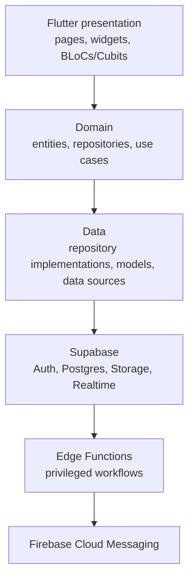

# Architecture

## Overview

Ethio Venture uses Flutter as the client application and Supabase as the
backend platform. The Flutter codebase follows Clean Architecture and BLoC/Cubit
state management so UI, business rules, and data access remain independently
testable.



## Flutter layers

### Presentation

Pages and widgets render state and forward user intent to a BLoC or Cubit. They
must not query Supabase directly or contain business decision rules.

### Domain

The domain layer contains entities, repository contracts, and use cases. It is
independent of Flutter and Supabase implementation details. A use case has one
clear application action, such as `CreateStartupProfile` or `SendMessage`.

### Data

Data sources call Supabase services. Repository implementations map DTO/models
to domain entities and translate expected backend failures into application
failures. This layer owns query details, pagination, and serialization.

### Core

`lib/core` holds cross-cutting utilities such as configuration, errors, routing,
theme, dependency injection, and the shared Supabase client. Feature-specific
rules do not belong here.

## Feature layout

```text
lib/features/<feature>/
  data/           # models, data sources, repository implementations
  domain/         # entities, repository contracts, use cases
  presentation/   # pages, widgets, BLoCs/Cubits
```

Cross-feature dependencies should flow through a domain contract or a shared
core abstraction. Avoid importing a feature's data layer from another feature.

## Backend responsibilities

| Service | Responsibility |
| --- | --- |
| Supabase Auth | Identity, sessions, password recovery, and auth events |
| Supabase Postgres | Profiles, preferences, matches, conversations, and notifications |
| Supabase Storage | Pitch decks and supporting files with private, policy-controlled access |
| Supabase Realtime | Timely conversation and notification updates where needed |
| Edge Functions | Trusted workflows, notification dispatch, and operations requiring secrets |
| Firebase Cloud Messaging | Device push delivery only; it is not the source of truth for notifications |

## Key design rules

- Enforce data access with Row Level Security on every application table.
- Keep service-role credentials only in Edge Functions or secure server
  environments, never in Flutter.
- Write notification records to Postgres before attempting push delivery.
- Use Edge Functions for actions that require cross-user access or a third-party
  secret, such as delivering FCM notifications.
- Model backend errors as domain failures so the presentation layer can display
  appropriate feedback.

## Dependency flow

Dependencies point inward: presentation depends on domain; data depends on
domain; domain depends on neither. Dependency injection wires concrete data
repositories to domain contracts at application startup.
