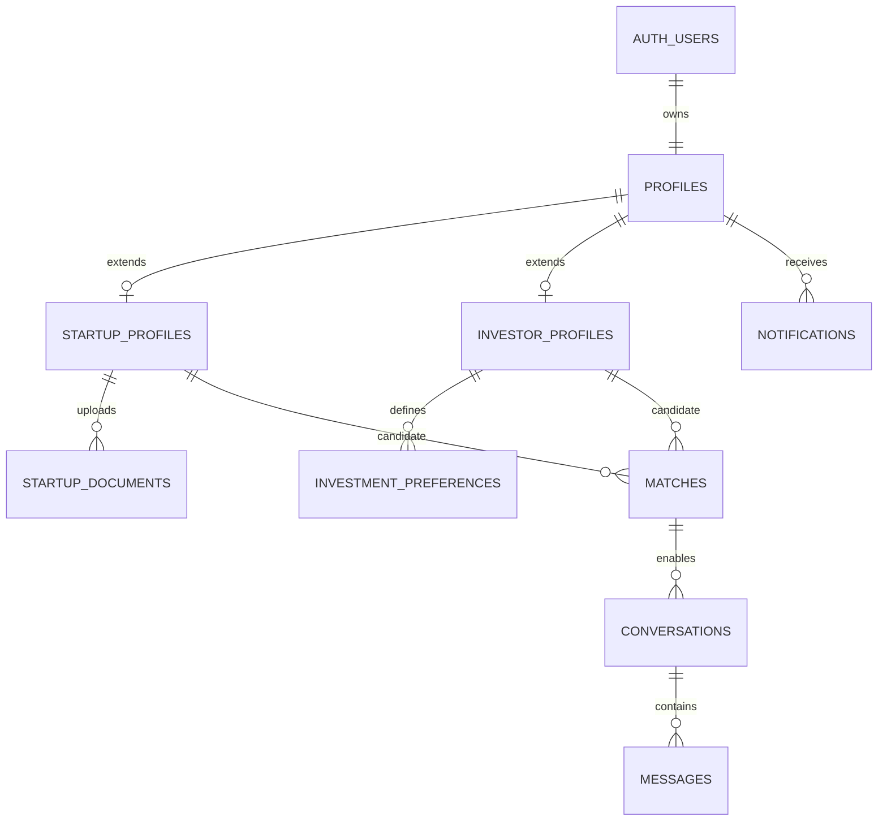

# Database design

## Purpose and status

This is the proposed Supabase/Postgres data model for Ethio Venture. Treat it
as a design contract until versioned SQL migrations are added under
`supabase/migrations/`. Do not create production tables manually from this
document.

## Core entities

| Table | Key fields | Purpose |
| --- | --- | --- |
| `profiles` | `id` (references `auth.users.id`), `role`, `full_name`, timestamps | Shared account record and application role |
| `startup_profiles` | `profile_id`, `name`, `summary`, `industry`, `stage`, `location`, `funding_target`, `status` | Founder-managed startup data |
| `investor_profiles` | `profile_id`, `organisation_name`, `bio`, `location` | Investor identity and organisation data |
| `investment_preferences` | `investor_profile_id`, industries, stages, locations, ticket range | Search and matching criteria |
| `startup_documents` | `startup_profile_id`, `storage_path`, `type`, `visibility` | Metadata for files stored in Supabase Storage |
| `matches` | startup, investor, score, reasons, status, timestamps | A potential or accepted startup–investor relationship |
| `conversations` | `match_id`, timestamps | A conversation allowed by a match or approved contact flow |
| `messages` | `conversation_id`, `sender_profile_id`, body, read timestamp | Individual message records |
| `notifications` | `profile_id`, type, payload, read timestamp | In-app notification source of truth |
| `device_tokens` | `profile_id`, FCM token, platform, last-seen timestamp | Registered push devices; treat tokens as sensitive personal data |
| `audit_logs` | actor, action, target, metadata, timestamp | Administrative security and moderation record |

## Data integrity

- Use UUID primary keys that align user-owned records with `auth.users.id`.
- Add `created_at` and `updated_at` columns to mutable tables; maintain the
  latter with a database trigger.
- Put controlled values such as role, profile status, document type, and match
  status behind PostgreSQL enums or validated check constraints.
- Add unique constraints preventing duplicate startup/investor match pairs and
  duplicate device tokens.
- Add indexes for profile discovery filters, match participants, conversation
  messages, and unread notifications.
- Store documents in Storage, not in Postgres. Store only a path and metadata
  in `startup_documents`.

## Row Level Security policy intent

| Resource | Read | Write |
| --- | --- | --- |
| Own profile and role extension | Owner | Owner, with role/status fields protected from self-escalation |
| Published startup profile | Authenticated users, subject to visibility | Owning founder only |
| Investor preference | Owner only | Owner only |
| Pitch documents | Owner and explicitly authorized investors | Owning founder only |
| Match | The paired founder and investor | Server-controlled matching workflow |
| Conversation and messages | Conversation participants | Participants; sender identity must equal `auth.uid()` |
| Notifications and device tokens | Owner only | Owner or trusted Edge Function, as applicable |
| Audit logs | Administrator only | Trusted server-side workflow only |

RLS must be enabled for every table and Storage bucket. Test every policy with
the publishable client key; an administrator UI alone is not an authorization
mechanism.

## Matching strategy

Start with a transparent rule-based score: industry, funding stage, location,
and ticket-range compatibility. Save both the score and a structured list of
match reasons. Any future machine-learning ranking must keep the same access
rules, be explainable to users, and be evaluated for fairness.
